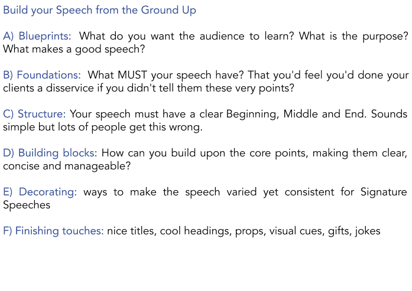

# Welcome Page

## Getting Super Powers

Becoming a super hero is a fairly straight forward process:

```
$ give me super-powers
```







* [x] dshf iduhf idhf
* [x] is;fh;idfhish f
* [x] s'iohdoasihdaosihd




 Please do take time to actually DO the tasks!.


Once you're strong enough, save the world:


```bash
# Ain't no code for that yet, sorry
echo 'You got to trust me on this, I saved the world'

ewiwjoij foj;s ofjs ;odijf 
ewpojr'ewepojr
wejpjr'e
```


;oshofho

ewuh;kihsfdkjes

;sbdskjbdkn




